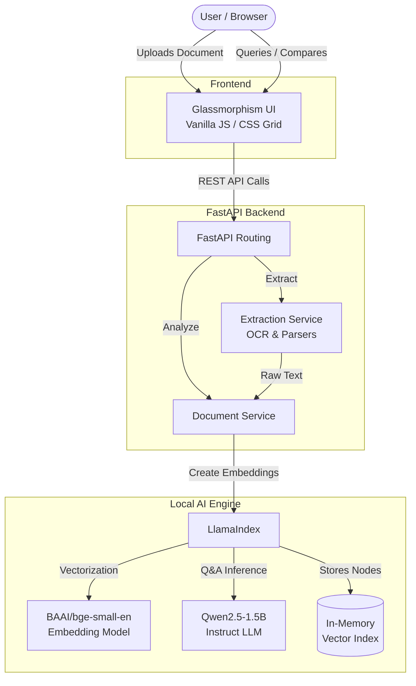

# DocuQuery AI

**DocuQuery AI** is an intelligent Document Analysis and Comparison application. The core functionality includes uploading documents, intelligently parsing them with AI, querying/chatting with them, and running advanced algorithmic comparisons. Built on a powerful modern tech stack, it utilizes **Python and FastAPI** for the backend, **LlamaIndex and HuggingFace** for local LLMs and Vector Embeddings, and a beautiful **Vanilla HTML/CSS/JS Glassmorphism** frontend.

## Screenshots

<p align="center">
  
</p>
<p align="center">
  
</p>
<p align="center">
  
</p>

## System Architecture



## Features

- **Document Parsing:** Upload images (PNG/JPG), PDFs, Word Documents, and Excel spreadsheets.
- **Split-Screen OCR Editor:** Side-by-side view of the uploaded document and the extracted text, allowing for manual typo correction.
- **AI Document Q&A:** A built-in chat interface to interrogate the document. Powered by an in-memory `VectorStoreIndex` using HuggingFace models for lightning-fast retrieval.
- **Advanced Contextual Comparison:**
  - **Exact Words:** Analyzes pure keyword overlap.
  - **Paragraph Coverage:** Slices target texts (like Job Descriptions) into paragraphs and checks if your document has sufficient keyword coverage for every single paragraph.
  - **AI Semantic Context:** Uses Vector Embeddings to measure semantic meaning, matching similar concepts even if the exact vocabulary differs.
- **Missing Keywords Detection:** Automatically extracts and flags the exact keywords that your uploaded document is missing compared to the target text.

## Tech Stack

- **Backend:** Python, FastAPI, LlamaIndex, HuggingFace (`Qwen/Qwen2.5-1.5B-Instruct`), SentenceTransformers
- **Frontend:** Vanilla HTML/CSS/JS, CSS Grid, Glassmorphism UI
- **Local AI Engine:** Completely private execution running on local hardware.

## Installation

1. Clone the repository:
   ```bash
   git clone https://github.com/yourusername/docuquery-ai.git
   cd docuquery-ai
   ```

2. Setup the Python Virtual Environment:
   ```bash
   cd backend
   python -m venv venv
   source venv/bin/activate  # On Windows use `venv\Scripts\activate`
   pip install -r ../requirements.txt
   ```

3. Configure Environment Variables:
   Create a `.env` file in the `backend` folder and add any necessary keys.

## Running the Application

There is a master script that boots both the backend API and frontend HTTP server.

```bash
python run.py
```

The frontend will be available at `http://localhost:4000` and the backend at `http://127.0.0.1:8000`.


